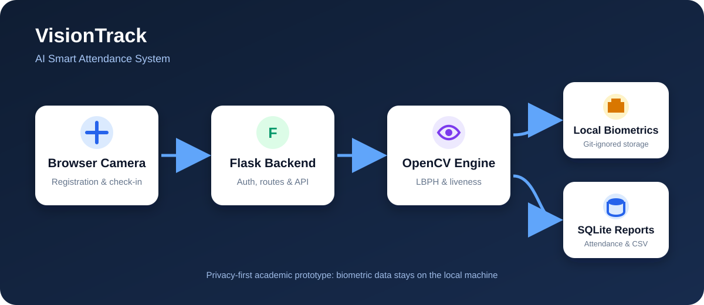

# VisionTrack - AI Smart Attendance System

An advanced final-year CSE project that automates classroom attendance using face recognition and active liveness verification. The application combines a Flask backend, OpenCV computer vision, SQLite persistence, and a responsive browser interface.

## System Architecture



## Features

- Browser-camera student registration
- Multi-sample face detection and LBPH model training
- Active movement-based liveness challenge
- Automatic one-entry-per-day attendance
- Admin authentication and dashboard analytics
- Student directory and daily reports
- CSV attendance export
- Responsive mobile-friendly interface
- Local biometric storage excluded from GitHub

## Technology Stack

- **Backend:** Python, Flask
- **Computer vision:** OpenCV, Haar Cascade, LBPH
- **Database:** SQLite
- **Frontend:** HTML, CSS, JavaScript
- **Testing:** Pytest

## Project Structure

```text
visiontrack-ai-attendance/
|-- app.py                 # Flask routes and application logic
|-- face_engine.py         # Face detection, training and recognition
|-- schema.sql             # SQLite database schema
|-- static/                # Styles and browser camera logic
|-- templates/             # Jinja2 user-interface templates
|-- tests/                 # Automated Flask tests
|-- docs/architecture.svg  # Privacy-safe system architecture
|-- requirements.txt
`-- Procfile
```

## Run on Windows

```powershell
python -m venv .venv
.venv\Scripts\activate
pip install -r requirements.txt
flask --app app init-db
flask --app app run
```

Open `http://127.0.0.1:5000`. Login: `admin` / `admin123`.

Allow camera permission in the browser. Register a student with five face samples before using recognition.

## Run Tests

```powershell
pytest -q
```

## Privacy and Limitations

Face samples, the trained model, and the local attendance database are stored in `instance/`, which is excluded from GitHub. Screenshots containing camera images or personal email addresses are also excluded. The liveness check is an academic movement-analysis prototype and is not suitable for high-security identity verification without a production anti-spoofing model, consent workflow, encryption, and a formal privacy assessment.

## Author

Deeksha TM
